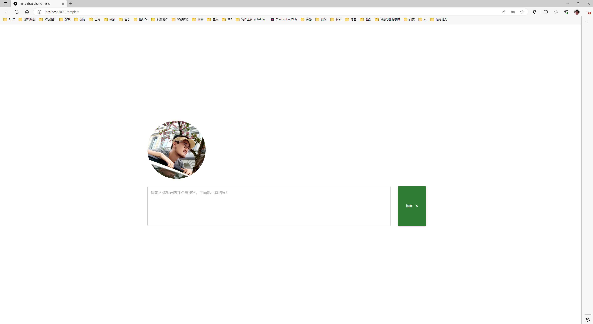

# IMDT Go

以下教程会教你如何从零开始Build、修改、上传IMDT Go对话系统。


## 配置环境

- Git [Git (git-scm.com)](https://git-scm.com/)
- NodeJS [Node.js (nodejs.org)](https://nodejs.org/en)


## 克隆到本地

### 如果你是Windows

使用终端或者Powershell在你要保存的目录下，执行

```bash
git clone https://github.com/scyq/IMDTGo.git
```

**Tips:** Windows下，在资源管理器中，*Shift + 鼠标右键* 可以快速打开Powershell


### 如果你是Mac

很多年不用Mac了，但在你要保存的目录下，打开 **Terminal** 执行：

```bash
git clone https://github.com/scyq/IMDTGo.git
```


## 项目结构说明

下面对项目重要的文件和目录进行说明

│  package.json				  //  包体配置文件
│  README.md                   //  你现在正在阅读的说明书
├─app								 //  项目主要文件  								 
│  │  favicon.ico                 //  网页的icon 
│  │  globals.css                 //  全局的CSS文件
│  ├─components             //  组件，这里就放了一个GPT.js
│  │      GPT.js                      //  用于和openai通信的组件
│  └─template                    //  核心页面
│          layout.js                   //  页面布局，一般不改这个，你会改也可以
│          page.js                     //  页面主要内容，主要修改这个
│          template.css           //  template页面CSS
└─public                              // 存放静态文件的文件夹
        testAvatar.jpg             // template中方老师的头像

## 开发推荐手段

1. 下载Visual Studio Code
2. 下载Chromium内核的浏览器（Chrome和Edge）
3. 简单了解HTML和CSS以及网页是由什么组成的
4. 简单学习一下JavaScript语法（既面向对象又函数式）
5. 简单理解ChatGPT Prompt工作原理
6. 简单理解React机制
7. **联系陈宇卿**


## 如何跑起来

1. 确保环境配置正确
2. 使用vscode打开项目根目录，并且在根目录下打开终端（vscode中可以点顶部的 *终端-新建终端* 打开）
3. 把目录 *app-components-GPT.js* 文件里的KEY替换为群里发的KEY
4. 终端输入 ` npm install` 安装所需要的包


5. 终端输入 `npm run dev` 启动！


6. 如果看到这个界面，说明幸运的你成功了




## 如何快速创建一个属于我的页面

如果你完全熟悉前端、React请随意修改，但请保证提交的时候**你的内容为单一文件夹形式存在于components文件夹下**，否则代码不会被Merge（就像template文件夹一样）。

如果你不熟悉：

1. 复制一个template文件夹并修改为你想要的页面名称
2. 修改page.js的rolePrompt来塑造你的角色
3. 放一张图片（最好是正方形）到public文件夹下
4. 修改page.js的avatarURL为刚刚图片的路径修改角色的avatar
5. 重新运行，并把地址 `localhost:3000/template` 最后的template改为 `localhost:3000/your_page_name`， 这里的`your_page_name`就是你刚刚文件夹的名字


## 如何调试

如果你熟悉前端调试甚至知道怎么看网络包、Header信息等，你来带带我。否则可以使用输出调试法。JavaScript是一个单线程异步语言，不会有固定断点。尽量多使用 `console.log()`来输出信息。

**在浏览器中F12打开开发者工具可以看到控制台输出**


## 如何提交

在你创建了自己的页面后，要将修改提交到GitHub上面。主分支开启了提交保护，所以无法直接提交到主分支，需要通过Pull Request进行合并。

请在根目录的终端中使用命令行执行指令：

1. 切换到你自己的分支 `git checkout -b xxx-yyy` ，这里xxx-yyy是你的分支名字，

**分支命名规则为：xxx-yyy，xxx为你角色英文或者拼音缩写，yyy为提交者的名字缩写。例如panda-fangke，意思是方可创建的熊猫角色。不符合命名规则的分支不会进行code review。**

2. 确认提交所有文件 `git add *`
3. 确认提交 `git commit -m "say something"`
4. 提交到远程 `git push --set-upstream origin xxx-yyy`

这个过程第一次运行的同学可能会遇到GitHub登录问题，Windows按照操作提示即可。


## 如何提升在本项目中的开发水平

1. 学HTML、CSS、JavaScript基础三剑客
2. 看MDN、Runoob等前端相关内容
3. 看吴恩达的Prompting Engineering了解Prompt的基础
4. 善用搜索引擎（特指Google和Bing国际版）


